# RentRobes
#### Idea Behind RentRobes              
RentRobes is an android app which provides an platform for renting of clothes and selling of second hand clothes. This is an implementation of an start-up idea. The basic idea to provide users with the facility of selling branded second hand clothes to the company and renting branded clothes both brand new and second hand clothes. 
It is an user friendly app which provides user to select clothes ranging from traditional to foramls both for men and women. It also provides different types accessories for both women and men.

#### Screenshots
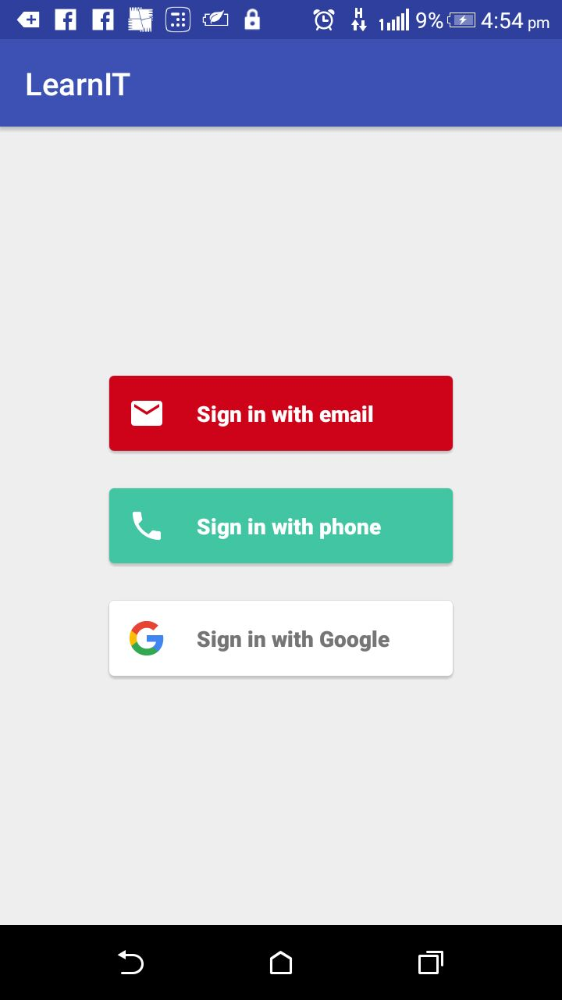
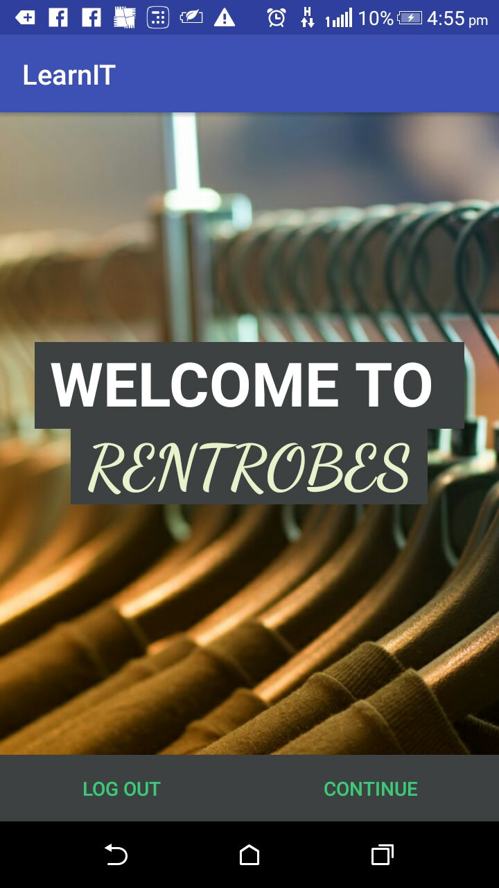
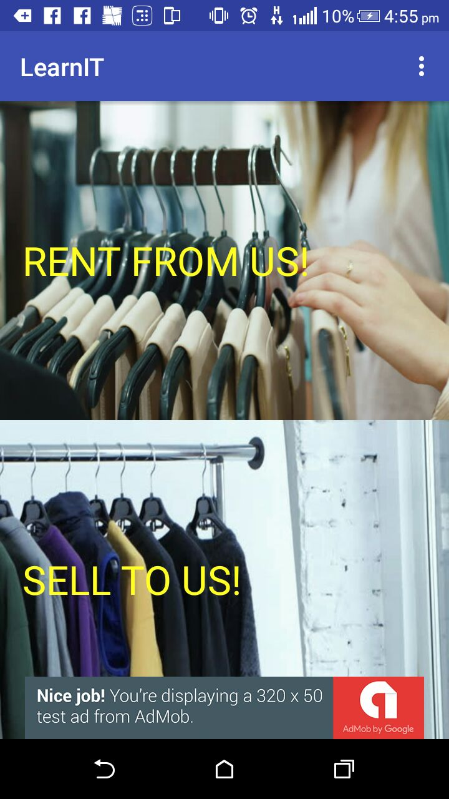
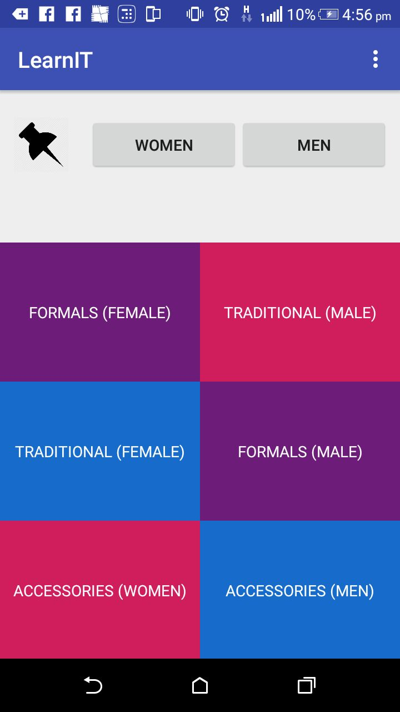
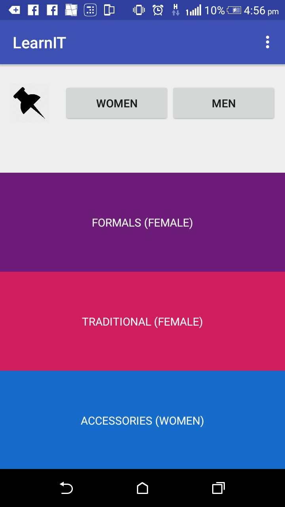
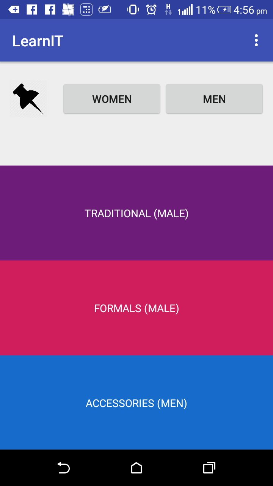

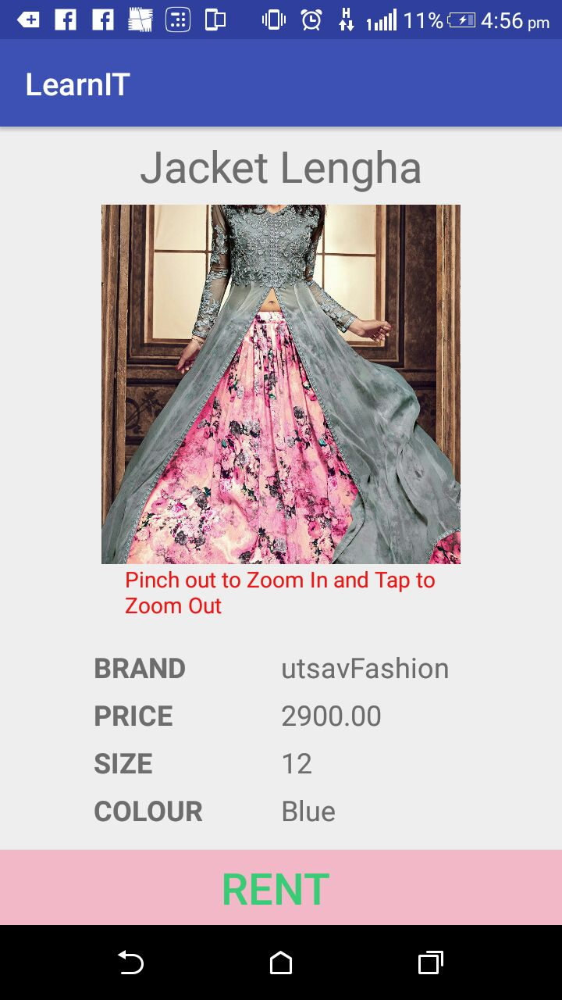
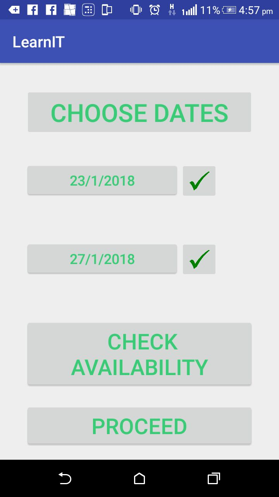
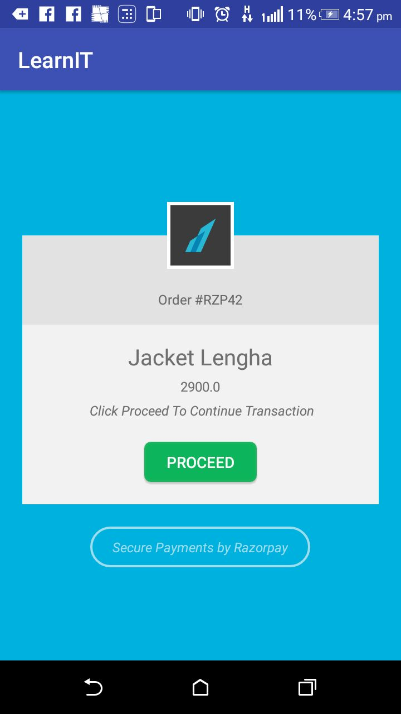
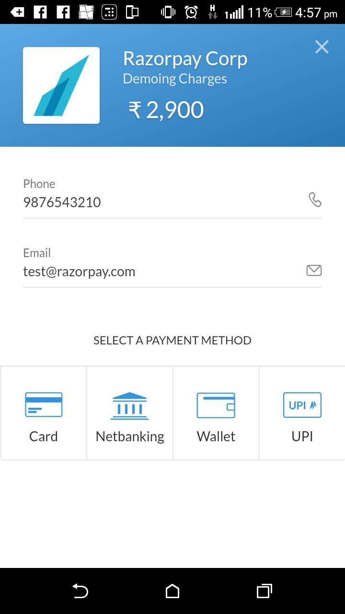
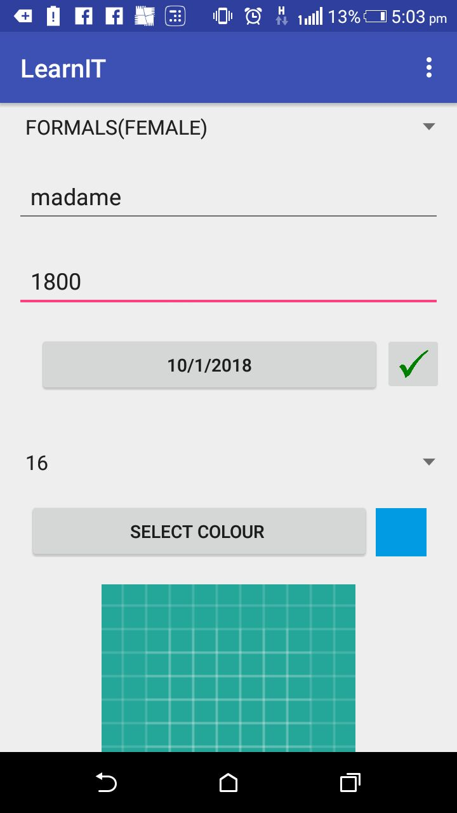
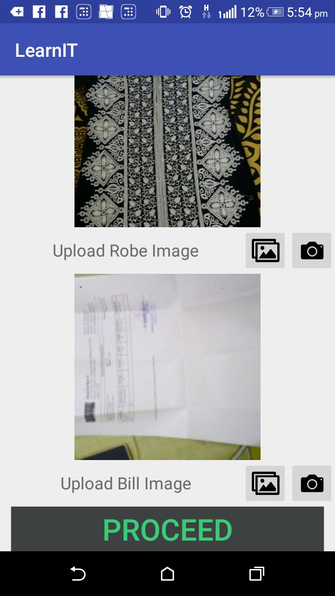
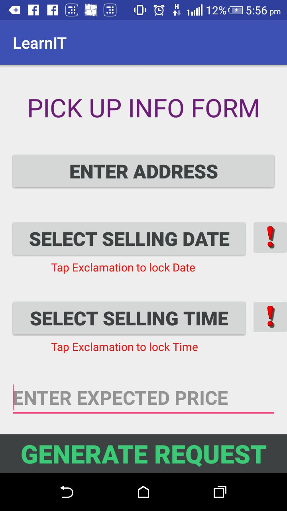
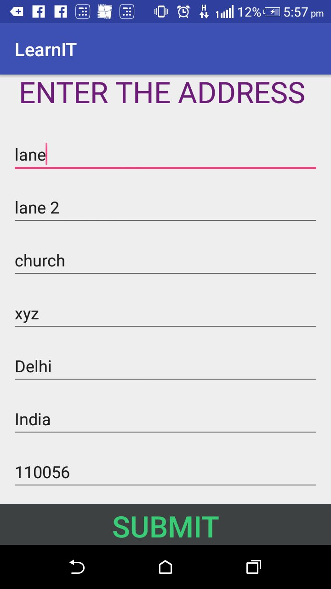
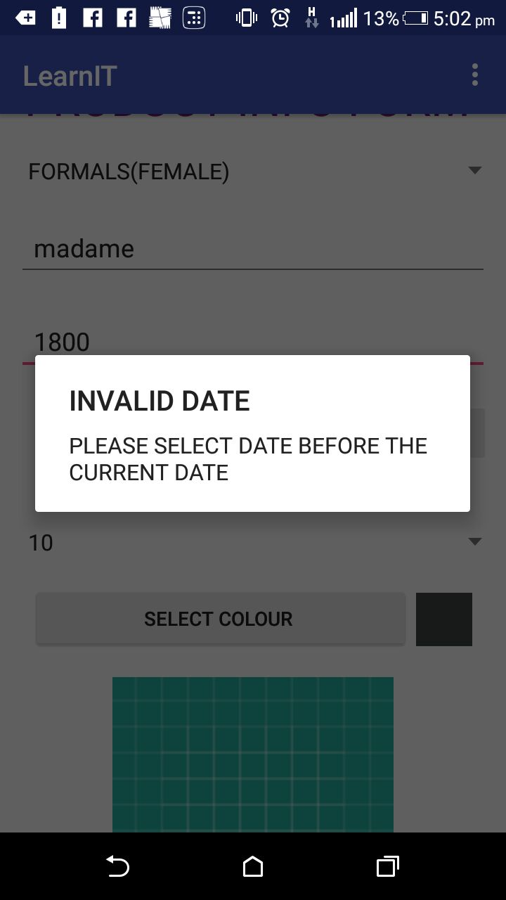

###### This project is made under the supervision and guidance of Ms Apoorva Bhalla , Mentor Learn IT, Girl 3rd edition .
